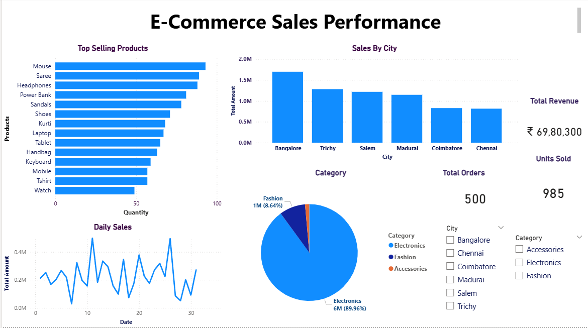

E-Commerce Sales Performance Dashboard

Executive Summary

This project delivers an interactive sales performance dashboard designed to analyze e-commerce transactions and generate actionable business insights. Using Python for data preparation and Power BI for visualization, the dashboard enables stakeholders to monitor revenue trends, product performance, and regional sales distribution.

Business Objective

The objective of this project is to transform raw sales data into meaningful insights that support:

* Revenue growth analysis
* Product demand evaluation
* Regional performance monitoring
* Category contribution assessment
* Data-driven decision making

Dataset Description

The dataset contains transactional eCommerce sales data collected across multiple regions and product categories. It represents customer purchase behavior and revenue performance.

Key Fields

Order ID – Unique identifier for each transaction

Order Date – Date when the order was placed

Customer ID – Unique customer identifier

Region – Sales region (North, South, East, West)

Product Category – Category of the product sold

Product Name – Name of the product

Quantity – Number of units sold

Unit Price – Price per unit

Total Sales – Total revenue generated per order

Payment Mode – Payment method used (UPI, Card, COD, Net Banking)  

Tools & Technologies:

Database

* MySQL

Data Processing & Analysis

* Python (Pandas)

Data Visualization

* Power BI Desktop

Data Source

* CSV dataset

Data Preparation & Transformation:

Data preprocessing was performed using Python to ensure accuracy and consistency:

* Cleaned and validated dataset
* Standardized date formats
* Checked for missing or duplicate values
* Verified numeric fields and totals

Dashboard Features

Key Performance Indicators (KPIs)

 *Total Revenue
 *Total Orders
 *Units Sold

Visual Analytics

* Top Selling Products
* Sales by City
* Category-wise Revenue Distribution
* Daily Sales Trend Analysis
* Interactive Filters (City & Category)

 Key Insights
 
Sales Performance

          Electronics category contributes the largest share of total revenue.

Fashion and Accessories categories show consistent demand.

Regional Trends

       West region generates the highest overall sales.

       South region shows steady growth potential.

       North region contributes comparatively lower revenue.

Top Performing Products

       Smartphones and accessories dominate revenue.

       High-value electronic items drive overall profitability.

ales Trends

       Peak sales observed during festive and promotional periods.

       Month-end spikes indicate discount-driven purchasing behavior.

Payment Behavior

       UPI and card payments dominate transactions.

       Cash on Delivery usage is declining, indicating digital adoption.

Business Insights

Focus marketing campaigns on high-performing electronics products.

Increase promotions in low-performing regions to boost sales.

Optimize inventory for fast-moving products.

Plan seasonal campaigns around peak purchase periods.

Encourage digital payments to streamline transaction processing. 

Key Insights

* Electronics category contributes the majority of revenue.
* Bangalore leads overall sales performance.
* A small group of products drives a significant portion of total sales.
* Daily revenue trends indicate fluctuating purchasing patterns.

Repository Structure

ecommerce/
│
├── Analysis.py                 Data cleaning & preprocessing
├── orders.csv                  Raw dataset
├── sales dashboard.pbix        Power BI dashboard file
├── Top_Selling_Products.png    Dashboard preview
└── README.md                   Project documentation

How to Run the Project

Step 1: Data Preparation

Run the Python script:

python Analysis.py

Step 2: Open Dashboard

1. Open sales_dashboard.pbix in Power BI Desktop
2. Refresh the dataset if required
3. Use filters to explore insights

   

Business Value

This dashboard enables business users to:

✔ Identify high-performing products
✔ Monitor regional demand patterns
✔ Track revenue trends over time
✔ Support strategic sales decisions

Future Enhancements

* Integration with SQL database
* Automated data refresh
* Advanced KPI metrics (profit, growth rate)
* Predictive sales forecasting

Author:

Kaviya Arumaidurai
Data Analyst

Skills: MYSQL • Python • Power BI • Data Visualization • Business Analytics

License

This project is for educational and portfolio purposes.

